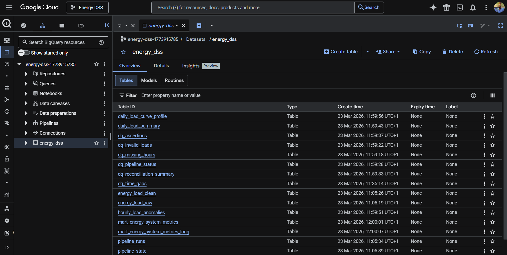
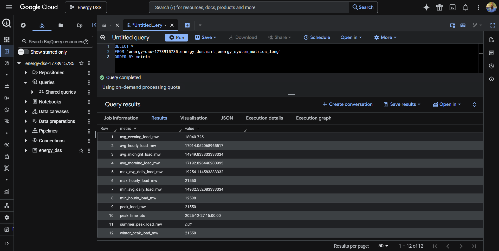
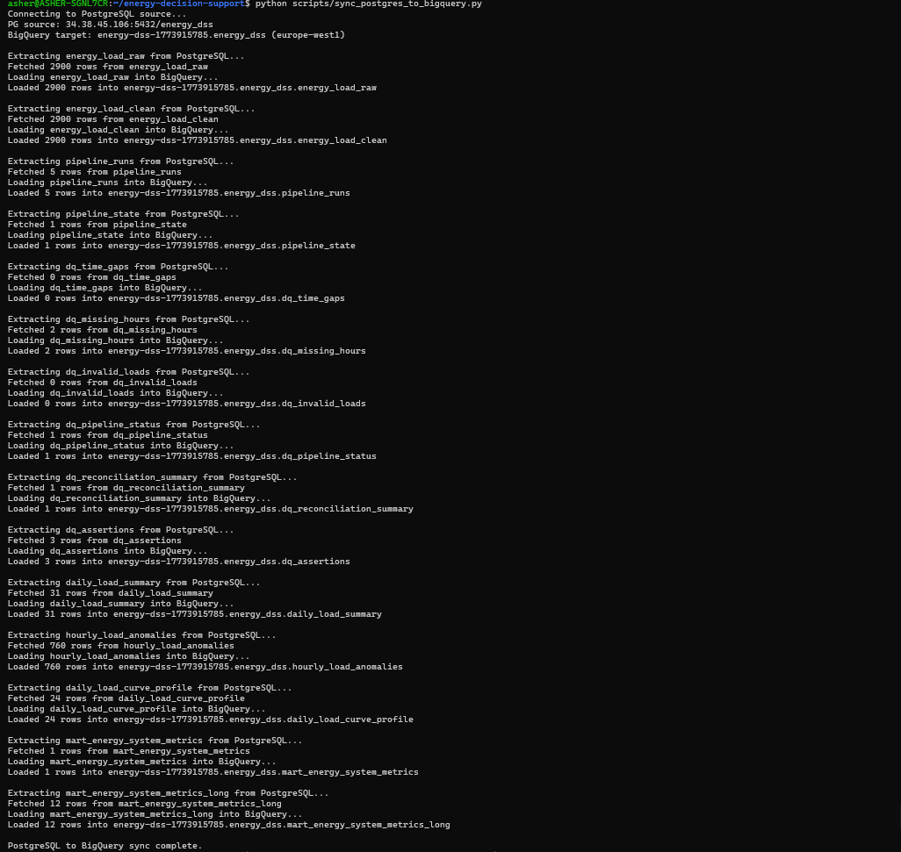
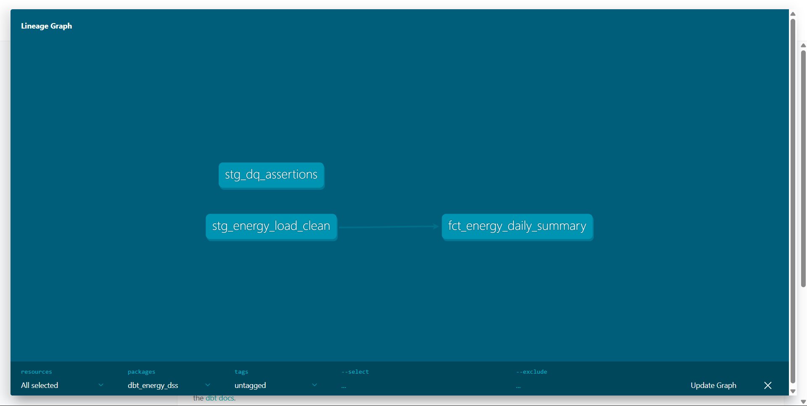
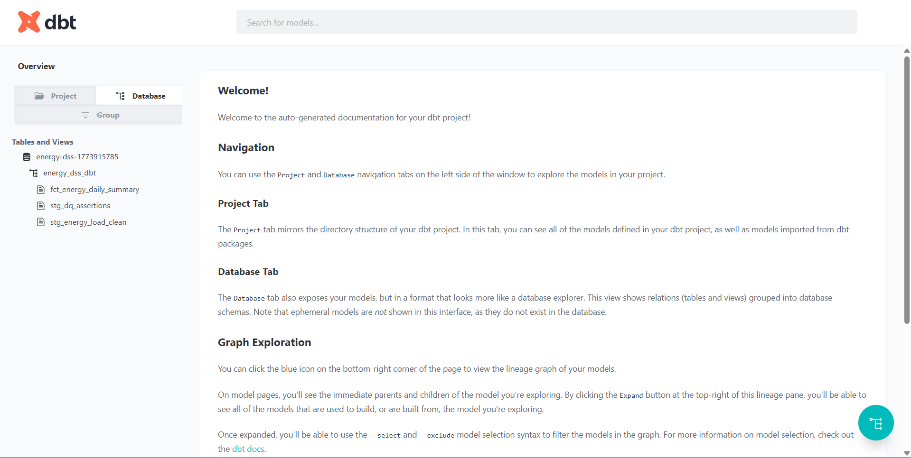
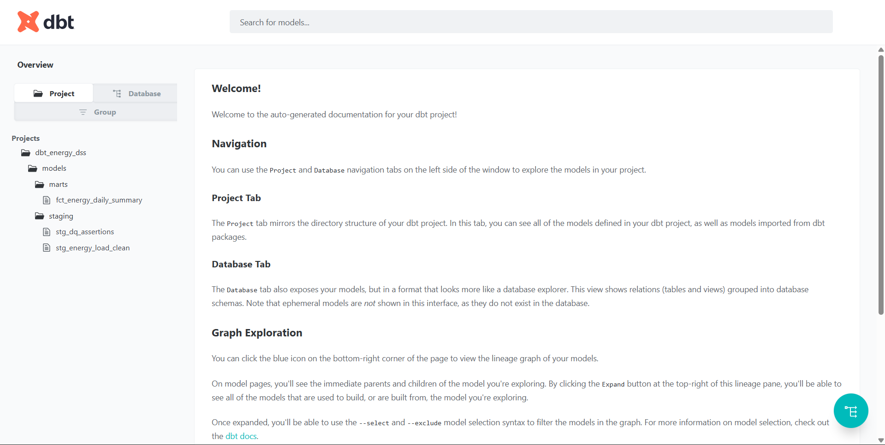
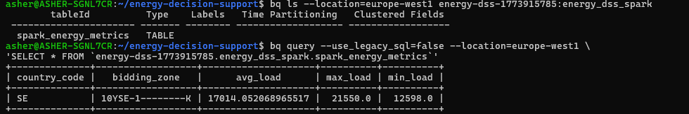

# Energy Decision Support System (DSS)

*A reproducible data engineering pipeline for electricity demand analytics and operational insight.*

---

## Overview

This project implements a **data engineering pipeline for electricity demand analytics** using publicly available grid data from the **ENTSO-E Transparency Platform**.

The system ingests hourly electricity demand observations, validates the integrity of the time series, and produces analytical views that support **energy system monitoring and decision support**.

The pipeline emphasizes:

- reproducible data engineering workflows
- explicit data quality validation
- transparent analytical transformations

---

## System Architecture

The system implements a layered analytical warehouse model:

```
Raw Layer
   ↓
Quality Validation Layer
   ↓
Clean Analytical Layer
   ↓
Decision Support Views
```

A detailed explanation of the system architecture, data flow, and design rationale is available here:

➡️ **[docs/architecture.md](docs/architecture.md)**

---

## Cloud Reproducibility (GCP)

The pipeline is reproducible on GCP using Cloud SQL and BigQuery.

The pipeline was executed locally, data was ingested into Cloud SQL, and warehouse layers were synchronized into BigQuery for analytical querying.

### BigQuery Tables

The following categories of tables are available in BigQuery:

- Raw Layer: energy_load_raw  
- Clean Layer: energy_load_clean  
- Data Quality Layer: dq_*  
- Analytics Layer: daily_*  
- Mart Layer: mart_*  



### Analytical Output

Example analytical query:

```sql
SELECT *
FROM `energy-dss-1773915785.energy_dss.mart_energy_system_metrics_long`
ORDER BY metric;
```



### Sync Execution

PostgreSQL → BigQuery synchronization executed successfully:



---

## dbt Transformation Layer (BigQuery)

A dbt transformation layer was implemented on top of BigQuery to manage analytical transformations.

### Lineage Graph



### BigQuery Models



### Project Structure



---

## Batch Processing Layer (Apache Spark)

A distributed batch processing layer was implemented using Apache Spark on top of BigQuery.

This layer demonstrates large-scale aggregation and analytical computation outside of the core warehouse, simulating how heavy workloads can be offloaded to a distributed engine.

### Spark Transformation

- Reads from: `energy_dss.energy_load_clean` (BigQuery)
- Computes aggregated metrics:
  - average load
  - peak load
  - minimum load
- Writes results to: `energy_dss_spark.spark_energy_metrics`

### Spark Output (BigQuery)



---

## Repository Structure

```
energy-decision-support
│
├── README.md
│
├── docs
│   ├── architecture.md
│   └── architecture-diagram.png
│
├── docker
│   └── docker-compose.yaml
│
├── ingestion
│   └── batch
│       ├── ingest_entsoe.py
│       ├── db.py
│       ├── Dockerfile
│       └── requirements.txt
│
├── orchestration
│   └── kestra
│       └── energy_dss_pipeline.yml
│
├── warehouse
│   ├── raw
│   ├── clean
│   ├── admin
│   ├── dq
│   ├── analytics
│   ├── mart
│   └── schema.sql
│
├── scripts
│   └── deploy_kestra_flow.sh
│
└── LICENSE
```

---

## Pipeline Workflow

The pipeline is orchestrated using Kestra and executes the following stages:

1. **Ingestion**
   - Retrieve electricity demand data from ENTSO-E API
   - Parse XML into structured records
   - Load into `energy_load_raw`

2. **Clean Layer**
   - Filter invalid records
   - Normalize dataset into `energy_load_clean`

3. **Data Quality Layer**
   - Detect missing hours and time gaps
   - Validate load values
   - Generate pipeline status indicators

4. **Analytics Layer**
   - Daily summaries
   - Load anomaly detection
   - Load curve profiling

5. **Mart Layer**
   - Aggregate system-level metrics
   - Produce decision-ready indicators

6. **Validation**
   - Enforce DQ assertions
   - Fail pipeline if critical checks fail

---

## Running the System

Clone the repository:

```bash
git clone https://github.com/AsherJD-io/energy-decision-support.git
cd energy-decision-support
```

Create environment file:

```bash
cp .env.example .env
```

Start services:

```bash
docker compose -f docker/docker-compose.yaml up -d
```

Deploy Kestra flow:

```bash
bash scripts/deploy_kestra_flow.sh
```

Run pipeline:

1. Open Kestra UI: http://localhost:8087  
2. Navigate to `energy.energy_dss_pipeline`  
3. Click **Execute**

This pipeline will:

- ingest ENTSO-E data  
- build warehouse layers  
- validate data quality  
- produce analytical outputs  

---

## Roadmap

### Short Term
- stabilize batch ingestion and DQ layer
- improve pipeline observability and logging
- refine analytical views for decision support

### Mid Term
- extend Spark transformations for advanced aggregations
- optimize BigQuery storage and query performance
- introduce orchestration improvements for cloud workloads

### Long Term
- evolve into hybrid batch + streaming architecture
- integrate real-time ingestion (Kafka / Redpanda)
- introduce stream processing (Flink or streaming database)
- enable real-time decision support layer

---

## License

This project is licensed under the **MIT License**.

See the `LICENSE` file for details.
