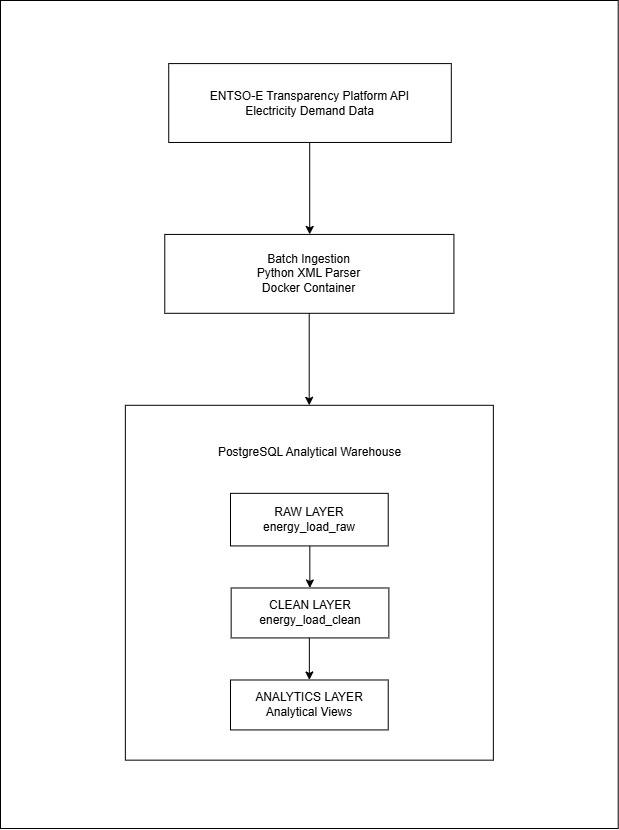

# Energy Decision Support System — Architecture



---

## 1. Overview

This project implements an Energy Decision Support System (DSS) designed to support analytical and planning decisions in electricity systems.

The architecture separates data ingestion, validation, storage, and analytical processing into distinct layers. This layered structure improves transparency, reproducibility, and reliability of analytical results.

---

## 2. System Objectives

The system is designed to:

- ingest electricity demand data from an authoritative external source
- store raw observations in a structured warehouse
- validate the integrity of time-series data
- produce analytical outputs that support energy system analysis

---

## 3. Data Source

The system uses electricity demand data from the **ENTSO-E Transparency Platform**, which publishes standardized electricity system data for the European power grid.

The pipeline specifically ingests **Actual Total Load** observations representing realized electricity demand at hourly resolution.

---

## 4. Architectural Layers

The system follows a layered analytical warehouse architecture.

The DSS warehouse follows a layered modeling pattern inspired by modern analytics engineering practices. This structure separates ingestion, normalization, validation, and analytical serving to maintain data lineage, reproducibility, and operational reliability.

This warehouse is structured into five logical layers:

- **Raw Layer**: `energy_load_raw`
- **Clean Layer**: `energy_load_clean`
- **Data Quality Layer**: `dq_time_gaps`, `dq_missing_hours`, `dq_invalid_loads`, `dq_pipeline_status`
- **Analytics Layer**: `daily_load_summary`, `hourly_load_anomalies`, `daily_load_curve_profile`
- **Mart Layer**: `mart_energy_system_metrics`, `mart_energy_system_metrics_long`

This design preserves raw source fidelity, normalizes the analytical base to hourly grain, exposes explicit data quality controls, and delivers decision-ready system indicators for downstream interpretation.

```
Raw Layer
   ↓
Clean Layer
   ↓
Data Quality Layer
   ↓
Analytics Layer
   ↓
Decision Support / Mart Layer
```

Each layer progressively improves data reliability and analytical usability.

---

### 4.1 Ingestion Layer

The ingestion layer retrieves electricity demand data from the ENTSO-E API.

Key characteristics:

- batch ingestion with explicit time windows
- containerized execution using Docker
- parameterized execution using environment variables

The ingestion process parses XML responses and inserts structured records into the warehouse.

---

### 4.2 Storage Layer

The storage layer consists of a PostgreSQL analytical warehouse.

Raw observations are stored in the table:

```
energy_load_raw
```

This table preserves the original temporal resolution and values provided by the external data source.

---

### 4.3 Data Quality Layer

The system performs explicit validation of the dataset before analytical processing.

Quality checks include:

- time-series continuity
- missing hourly observations
- invalid electricity demand values

Validation views include:

```
dq_time_gaps
dq_missing_hours
dq_invalid_loads
dq_pipeline_status
```

These views identify structural problems in the dataset.

---

### 4.4 Clean Analytical Layer

Validated observations are stored in the analytical base table:

```
energy_load_clean
```

Records in this table must satisfy:

- non-null demand values
- non-negative load values
- unique hourly records

This table represents the **trusted dataset for analytical queries**.

---

### 4.5 Analytics Layer

The analytical layer exposes operational insights through SQL views.

Key analytical outputs include:

```
daily_load_summary
hourly_load_anomalies
daily_load_curve_profile
```

These views transform hourly demand observations into interpretable operational indicators.

---

### 4.6 Decision Support / Mart Layer

The mart layer aggregates analytical outputs into system-level indicators used for interpretation and reporting.

Key outputs include:

```
mart_energy_system_metrics  
mart_energy_system_metrics_long  
```

These views summarize system-wide demand characteristics such as peak demand, load curve structure, and seasonal demand behaviour.

---

## 5. System Data Flow

```
ENTSO-E Transparency Platform
            │
            ▼
     Batch Ingestion
     (Python Parser)
            │
            ▼
      energy_load_raw
            │
            ▼
     Data Quality Validation
            │
            ▼
      energy_load_clean
            │
            ▼
      Analytical Views
```

Each stage progressively improves the reliability and interpretability of the dataset.

During validation of the normalized dataset, the expected number of hourly observations for the 2024–2025 period was compared against the actual dataset size. A perfectly continuous two-year hourly series would contain 17,544 observations. The validated dataset contains 17,524 rows, indicating 20 missing source hours within the original ENTSO-E data. These gaps are surfaced through the data quality layer (`dq_missing_hours`) and preserved as part of the system’s validation outputs rather than being artificially interpolated.

---

## 5.1 Analytical Warehouse Model

The DSS implements a layered warehouse structure commonly used in time-series analytics platforms.

### Raw Layer
Stores electricity demand data exactly as received from the source API.

### Clean Layer
Contains validated hourly observations where invalid or inconsistent records have been removed.

### Analytics Layer
Contains derived analytical views used for operational interpretation.

### Mart Layer
Contains aggregated decision-support indicators derived from analytical outputs.

This structure ensures:

- traceability of source data
- reproducibility of analytical outputs
- reliability of downstream queries

---

## 6. Design Rationale

The architecture emphasizes:

- **separation of concerns** between ingestion, storage, and analytics  
- **reproducibility** through containerized infrastructure  
- **extensibility** for future analytical layers and orchestration  
- **analytical transparency** through SQL-based transformations  

---

## 7. System Roadmap

The system evolves from a batch analytical pipeline into a hybrid decision support platform with distributed compute and real-time capabilities.

### Phase 1 — Batch Foundation (Completed)
- batch ingestion from ENTSO-E API
- raw → clean → dq → analytics → mart layers
- orchestration via Kestra
- PostgreSQL warehouse

### Phase 2 — Cloud Warehouse + Transformation (Completed)
- migration to BigQuery as analytical warehouse
- PostgreSQL → BigQuery synchronization
- dbt-based transformation layer on BigQuery
- cloud reproducibility established

### Phase 3 — Distributed Batch Processing (Completed)
- Spark-based batch processing on BigQuery data
- large-scale aggregations outside core warehouse
- materialized Spark outputs for analytical consumption

### Phase 4 — Advanced Analytics (Next)
- demand forecasting models
- anomaly detection and pattern analysis
- richer decision support metrics

### Phase 5 — Streaming Evolution (Future)
- real-time ingestion via Kafka / Redpanda
- stream processing using Flink or streaming database
- low-latency decision support layer

---

## 8. External Data Source Availability

The system integrates with the ENTSO-E Transparency Platform Web API.

During development, archived XML responses were used to allow pipeline development before live API credentials were activated.

Once API access is enabled, ingestion can switch to live mode without modification to:

- database schemas
- downstream transformations
- analytical outputs
